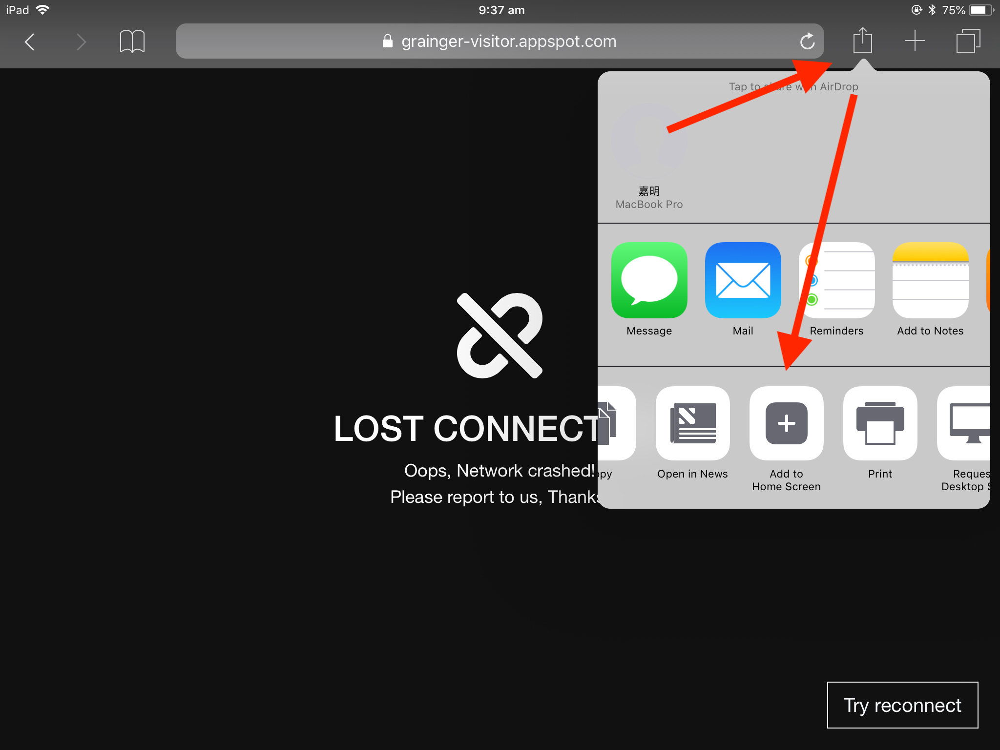

# Perfection | Stillness iPad app
This is a brief introduction and handbook for the **Perfection | Stillness** iPad app developed by _Allan Wu_.

## Setting up iPads 
URL: <https://grainger-visitor.appspot.com/tablet>
1. Open the tablet page in **Safari**.
1. On the top right corner, click **Share** button, then **Add to Home Screen**.
1. Open the **Perfection** just like an app from the home screen.
1. Set up guided access if required.

 
## Visitor page
URL: <https://grainger-visitor.appspot.com>\
This page can be accessed with the QR code.
This page is designed for small screens (such as mobile phones).\

## Playing music
URL: <https://grainger-visitor.appspot.com/tablet?player>
1. Open the music player with any device connected to speakers (**Edge** recommend).
2. If the music is not playing (on some browsers), click "Enable live music" manually.

This page is for playing the music, use it in the Grainger office! Feedback interface is hidden to reduce network traffic.

It will not post anything to the backend so it's safe to open any number of it at anywhere.
Login is not required any more!

> ~~URL: <https://grainger-visitor.appspot.com/player> (Login required)~~
> 1. ~~Open the music player with any device connected to speakers. Login if required.~~
> 1. ~~Select the music to play. Keep the device from sleep.~~
> 1. ~~**Important**: Only use **one** divice and only open **one** player at the same time!~~
> ##### ~~Controlling checkboxes:~~
> * ~~**Loop**: Continue playing another piece when finished one.~~
> * ~~**Shuffle**: Randomly pick next piece. Otherwise simply pick the next one by list order.~~

## Admin
URL: <https://grainger-visitor.appspot.com/player> (Login required)\
This page is for monitoring the database.
* **Keywords**: the keyword in the scroll bar.
* **Bullets**: the feedback messages.

## Bugs
Email me when anything goes wrong! <jiamingw@student.unimelb.edu.au>
